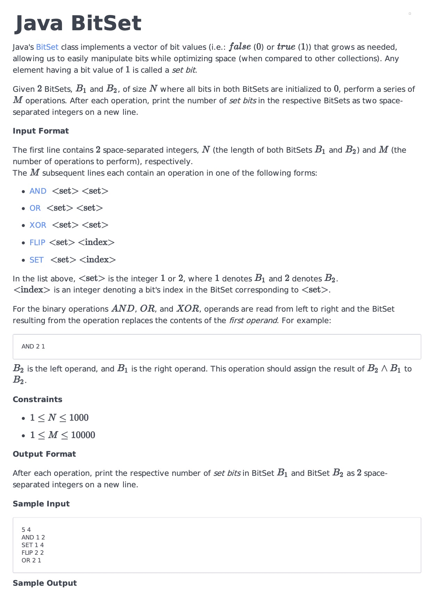
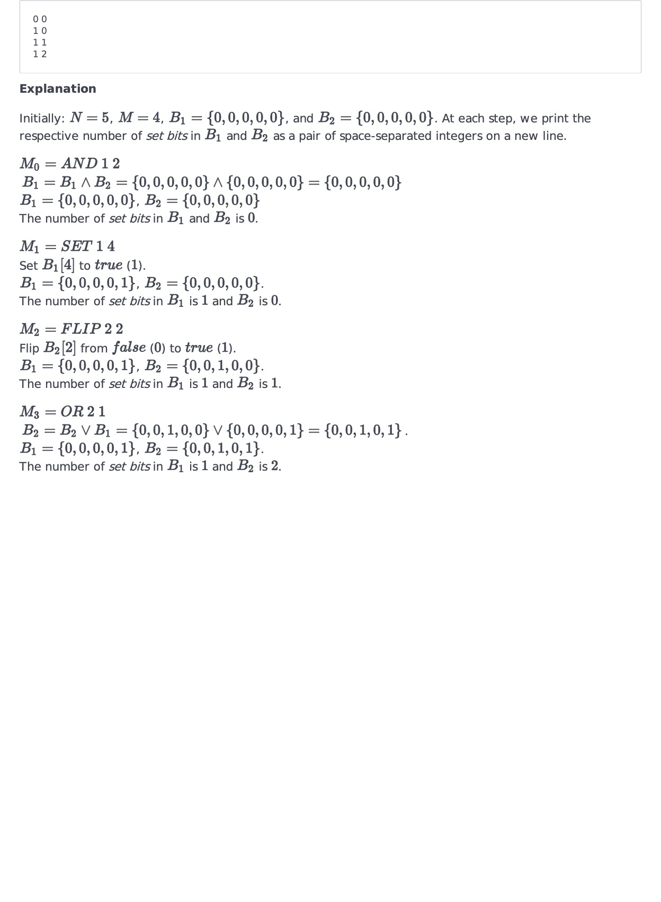

# Notes
- The input set contains an error (references an index position that is outside the bounds that they specified in the problem).
- To diagnose what the issue was, I did the following:
    - Wrote the app output to file.
    - Wrote a script to compare my output to the expected output
    - Cross referenced where the sets differed with the input
    - Noticed that the input file referenced the same index position everytime the outputs began to differ.
- Attached is one of the input sets for the problem.
- There are several more-efficient ways to write this. At the time, I was unaware of the .and(), .or(), and .xor() functions of the BitSet class. -- However, had I used the BitSet methods, I most likely would not have come across this error.
- Overall it was a good learning experience learning how to debug code (or input data in this case) and my first time working with the BitSet class.

# Original Problem
;
;